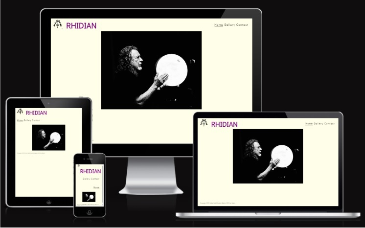
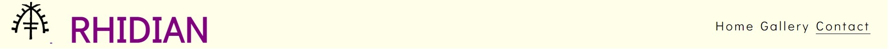
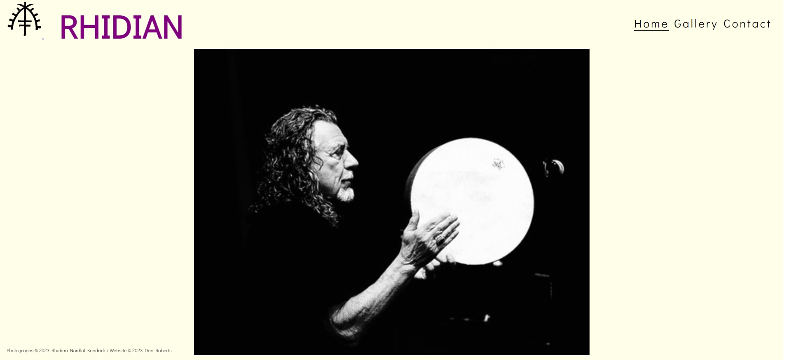
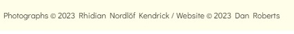
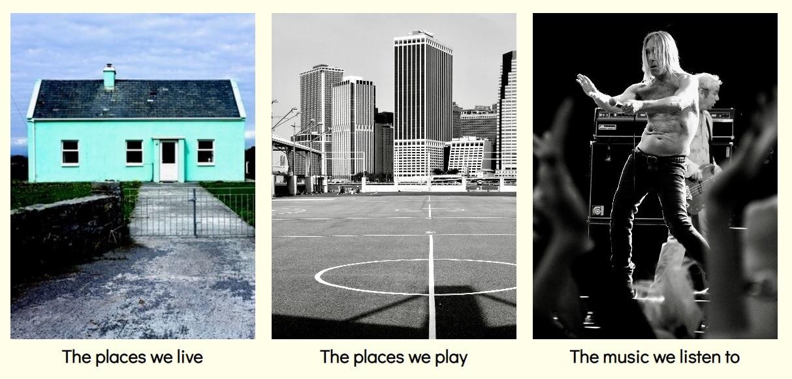
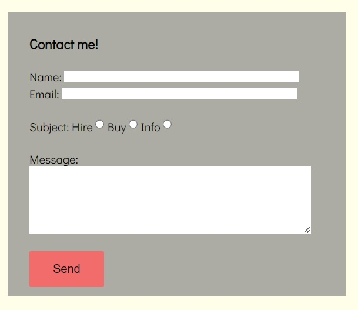
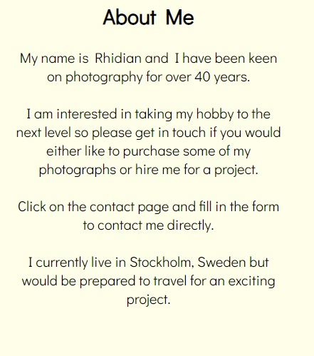
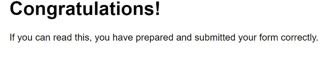
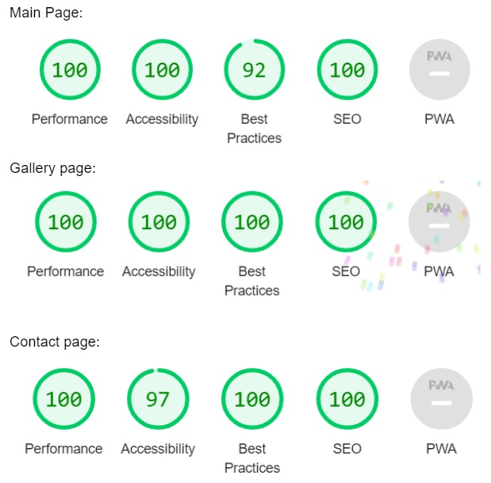

# Rhidian

This website is a showcase of some of the photographs of Stockholm-born amateur photographer Rhidian Nordlöf Kendrick. The website shows several photos taken by him and a preview of the range of photographs he has in his catalogue.

Visitors to the website also have the chance to contact Mr Kendrick to inquire into hiring him for a project, to purchase photographs, or just to ask a question. The website is targeted towards those keen on photography or those looking to purchase new pictures.

## Features

### Navigation

There are five navigation links in the header at the top of the page. The photographer’s logo and his name are at the top of the page and towards the left-hand side. Both links take the user back to the home page.

There are three more links on the right-hand side of the header and they are Home, Gallery and Contact. Home returns to the homepage, Gallery takes the viewer to the gallery section and Contact takes the viewer to the contact me/about me page. All five links are found on every page.

The photographer’s name and the links found to the right of the homepage are of the same font which provides consistency. Whereas the name logo is in a unique colour and in capital letters, the links to the right are more relaxed but are clearly visible to the visitor.

### Page layout

The header, as previously explained, holds five navigation features and these can be found on every page to help the visitor navigate the site.

The singular photograph on the main page is a simplistic design and with no text there, it draws the eye of the visitor to the photograph.

There is a footer which shows that the pictures are copyrighted and owned by the photographer.

The gallery page shows the three categories that the website will eventually show when fully completed. The  places people live, the places people play and the music people listen to. These pictures and their titles could be used as clickable links to take the visitor in to three different galleries featuring more photographs.

The contact page features both a contact me form and also a small section of information about the photographer. Visitors to the site can contact the photographer with a view to hiring him, purchasing photographs or just to enquire about other information.

The “About Me” section gives a brief description of the background of the photographer and helps the visitor to connect to him.

## Testing

The site has been tested in the browsers, Safari, Chrome and Firefox.

The site has been tested using dev tool function Lighthouse. See below for results.

The navigation links and functions of the website have all been tested and are all responsive and easy to comprehend.

I have checked that the Contact Me form is concise and its parts are functional.

## Bugs

There are a few design details that were not corrected. Under the media screen size of 950px, the layout of the contact form and the “About me” section contact page became distorted. Also the Name and Email input boxes of the Contact Me form are not aligned.

## Validator testing

HTML - W3C validator

CSS - official (jigsaw) validator

I believe the colours and background to be easy to read against the background. All three pages of the website have been run through dev tool Lighthouse.

## Deployment

The website has been deployed.

## Credits

The initial html code as well as code used to make the Contact Me form was taken from the Cl Love Running Project.
The information needed to complete the README.md was taken from Code Institue - Sample Project README.md
Help and guidance was also provided by CI mentor Akshat Garg and from Emer Heffernan.

Information and guidance about imaging was taken from W3 Schools

All images used on the website are taken by or created by Rhidian Nordlöf Kendrick.

[def]: readmepic1.jpg